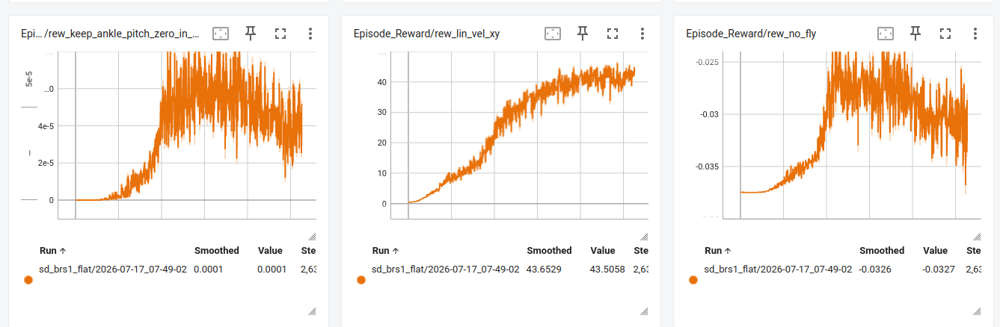
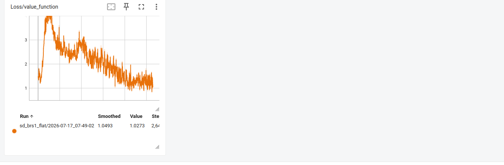
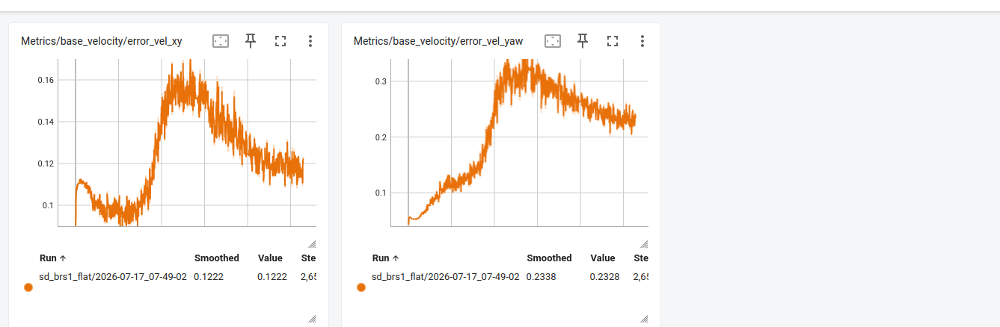

# A LIPM Guided Reward for Sample Efficient Co-Optimisation of Bipedal Morphology and Locomotion Policy

> Status, verified against the live sources on 2026-07-30. Outstanding, no part of this plan has been implemented. No reward term of this kind exists in `mdp/rewards.py` and none is configured in any environment, so the plan remains executable as written. The implementation seams it identifies were verified in the live code when it was written and are recorded in the LIPM section of `../context/knowledge_base.md`, and the source paper is held locally at `/ws/2509.09106v1.pdf`. Note the correction this document records, the paper's stated stable reward equation omits the negative exponent its own codomain requires, so an implementation must negate. See [README.md](README.md) for the full register.

This document surveys the literature on reducing the sample complexity of reinforcement learning for bipedal locomotion, develops the mathematical background of the linear inverted pendulum model and its principal variants, examines the mechanisms by which model based information accelerates policy learning, and culminates in a concrete implementation plan for the LIPM guided stability reward of Su et al. [1] within the COPT co-optimisation pipeline of this workspace. The codebase facts cited herein are grounded in `../ARCHITECTURE.md`, `../CO_OPTIMISATION.md`, the dumped context files `../context/knowledge_base.md`, `../context/literature.md`, `../context/task_plots.md` and `../context/copt.md`, and direct inspection of the live sources under `tron1-rl-isaaclab-cozum/exts/bipedal_locomotion/bipedal_locomotion/tasks/locomotion/`.

## 1. Introduction

The co-optimisation pipeline of this workspace jointly optimises the morphology and the locomotion policy of the LimX TRON1A SoleFoot biped. An inner loop trains a single design conditioned policy with PPO [55] across 4096 parallel Isaac Lab environments, while an outer CMA-ES loop replaces the morphology of the environments every 120 iterations, evaluating 64 candidate designs in round robin over the environment population. The design space comprises the thigh and shank length scales, each bounded to a fixed interval, and the policy is conditioned on the morphology through a sixteen dimensional latent produced by an estimator from privileged observations that include the per environment link lengths. The arrangement multiplies the sample complexity of an already expensive problem, every candidate design demands enough experience for the shared policy to adapt to it before its fitness can be judged, and the policy must simultaneously master a moving curriculum of terrain difficulty, push disturbances, and expanding command ranges.

The empirical consequence is a training signal of extraordinary variance that refuses to contract. The latest run, `sf_copt/2026-07-03_08-16-11`, trained for 45000 iterations over 3.4 days, exhibits a primary tracking reward that oscillates across nearly its entire attainable range for the whole duration of training, even after the outer CMA-ES loop has converged to a single design.



The panel above shows the episodic reward for linear velocity tracking, `Episode_Reward/rew_lin_vel_xy`, swinging between zero and above twenty on nearly every iteration to the very end of the run, alongside the similarly wide `rew_no_fly` band. The band never narrows, which is the central empirical fact motivating this document, the policy gradient is being estimated from returns whose across design and across iteration variance remains as large at convergence as it was at the start.



The value function loss remains large and spiky throughout, finishing at 11.27 with frequent excursions beyond the axis cap, despite the critic observing the per environment link lengths, masses and inertias directly. The difficulty is therefore not one of observability but of credit assignment, the critic must fit a value surface over a mixture of morphologies, terrains and curriculum states from returns that conflate all three.



The tracking error panels confirm that the oscillation is behavioural rather than a logging artefact, the velocity error in the horizontal plane still spans 0.1 to 0.5 m/s at the end of training, and roughly eleven percent of episodes still terminate in a fall at convergence, with the fall rate band itself refusing to tighten. The termination and curriculum panels of this run were not retained among the exported artefacts, so the two figures that once accompanied this passage were removed on 2026-07-30, and the measurements quoted here and below stand on the record of the original reading rather than on a figure a reader may re-examine.

The curriculum panels reveal a further confound, the command velocity ranges, tracking reward sharpening and terrain levels keep advancing deep into the run, injecting reward non-stationarity that is independent of the morphology variation. Any mechanism that supplies the learner with a dense, design aware and terrain aware learning signal, one whose meaning is invariant to the curriculum and to the design currently instantiated, is therefore a direct lever on the sample complexity of the whole pipeline. The remainder of this document argues that a reward derived from the linear inverted pendulum model is precisely such a mechanism, surveys the alternatives, and plans its implementation.

### 1.1 Related Work on Reducing Sample Complexity

The literature offers several families of techniques for reducing the number of environment interactions required to learn locomotion. We summarise each family briefly, in the manner of a survey, before deepening the treatment of the model based family in the following sub-section.

Massive parallelism and curriculum. Rudin et al. [22] demonstrated that thousands of GPU parallel environments paired with a game inspired terrain curriculum reduce wall clock training to minutes, establishing the substrate on which this workspace already operates. Curriculum learning does not reduce the number of transitions so much as it reorders them, presenting easy tasks first so that gradient signal is informative from the outset. The present pipeline already employs terrain, push and command curricula, and Section 1 shows they are simultaneously a variance confound.

Reward shaping. Ng, Harada and Russell [30] proved that shaping rewards of the potential based form preserve the optimal policy while densifying the learning signal, and shaping remains the most widespread sample efficiency device in legged locomotion. Jeon et al. [31] benchmarked potential based shaping on a humanoid and found only marginal convergence gains in that high dimensional setting, an instructive caution that shaping helps in proportion to how much task relevant structure the potential encodes. A physically principled potential, such as a stability measure derived from a template model, encodes far more structure than generic distance measures, which is the position adopted by Su et al. [1] and by this document.

Imitation and motion priors. Adversarial motion priors [29] and reference trajectory imitation [57] supply the learner with demonstrations of the desired motion manifold, collapsing the exploration problem onto a neighbourhood of the demonstrations. Green et al. [18] showed that a library of reduced order model trajectories can play the role of the demonstrator, which foreshadows the model based treatment below.

Privileged learning and concurrent estimation. The teacher student paradigm [23], rapid motor adaptation [24], perceptive distillation [25] and concurrent policy and estimator training [26] all exploit simulator privileged information to shorten learning, either by distilling a privileged teacher or by regressing privileged quantities as an auxiliary task. DreamWaQ [27] and the hybrid internal model [28] train encoder decoder estimators jointly with PPO in a single stage, and the CTS framework [52] on which Su et al. [1] build trains teacher and student concurrently. This workspace already instantiates this family twice, in the HIM runner and in the COPT-LEARNED estimator documented in `COPT_LEARNED_MODEL.md`.

Auxiliary representation objectives. UNREAL [32], SAC+AE [33] and self predictive representations [34] demonstrate, and Lyle et al. [35] analyse theoretically, that auxiliary prediction losses sharing an encoder with the RL objective shape representations toward task relevant features and reliably cut sample complexity. These findings underwrite the COPT-LEARNED extension and are complementary to reward level interventions.

Model based reinforcement learning. Learning or exploiting a dynamics model is the family with the strongest theoretical claim to sample efficiency, treated in Section 1.2 and Section 3.

Co-design specific amortisation. Within morphology and control co-optimisation, the recognised bottleneck is that every morphology change partially invalidates the co-adapted controller [45]. Design conditioned policies [46], surrogate fitness from design conditioned value functions [47], evolution at scale [48], transform and control policies [49], universal design conditioned controllers [50] and morphological pretraining [51] all amortise controller knowledge across the design distribution. The COPT pipeline already follows [46] in conditioning the policy on the design, the contribution contemplated here attacks the complementary lever, the per design cost of the inner RL loop itself.

### 1.2 Model Based Methods for Locomotion Learning

Model based methods deserve a deeper examination because they are the family into which the LIPM guided reward falls. Four distinct mechanisms recur in the locomotion literature.

Learned dynamics models for synthetic experience. PETS [37] showed that probabilistic ensembles of learned dynamics models achieve model free asymptotic performance with orders of magnitude fewer real transitions on control benchmarks. MBPO [38] interleaves short model rollouts branched from real states into the policy update and provides a monotonic improvement guarantee that degrades gracefully with model error. DreamerV3 [39] learns a latent world model and trains the policy entirely inside it, mastering over 150 domains including quadruped locomotion from pixels, and its physical robot instantiations learned quadruped walking in about an hour of real experience. The strength of this mechanism is generality, its weakness is compounding model error over rollout horizon, which is why MBPO keeps rollouts short.

Analytic template models as trajectory guides. Rather than learning a model, this mechanism imports a centuries old one. Green et al. [18] precompute a library of spring loaded inverted pendulum trajectories and reward the Cassie robot for reproducing them, obtaining stable spring mass running from a policy that never needed to discover the gait from scratch. Castillo et al. [19] use the LIP template to structure a task space bipedal policy, learning residual corrections around the template trajectory and reporting markedly more sample efficient and robust training than end to end baselines. Su et al. [1], the subject of this document, generate the desired centre of mass trajectory from a constraint plane LIPM online, inside the reward function itself, so that no offline library is required and the reference adapts to the commanded velocity at every step.

Model based planners in the loop. Deep tracking control [21] runs a model based trajectory optimiser online and trains an RL policy to track its output, marrying the foothold precision of optimisation with the robustness of learning. Lee, Hong and Kim [20] integrate an LIP based footstep planner with model free RL so that the planner supplies footstep targets and the policy realises them. These hybrids inherit the planner's sample efficiency but couple the learned policy to the planner's runtime presence.

Models as estimation targets. The concurrent estimator line [26], [27], [28] uses the simulator's privileged model quantities, velocities, contacts, terrain parameters, as supervised regression targets whose gradients shape the policy encoder. The COPT-LEARNED extension of this workspace, whose literature basis is recorded in `../context/literature.md`, regresses torques, accelerations, inertia and contact quantities from a morphology aware latent for exactly this purpose.

The LIPM guided reward of Su et al. [1] occupies the second mechanism, it is an analytic template model injected through the reward channel. Its ablations quantify the benefit directly, removing the stable reward drops the stair terrain success rate from 80.3 to 41.4 percent, and removing the double critic that isolates the stability return drops it to 52.7 percent, under identical training budgets [1]. Equal final performance under an equal budget is the operational signature of reduced sample complexity, the shaped learner extracts more improvement from the same data. To understand what this reward encodes, we require the model itself, to which we now turn.

## 2. The Inverted Pendulum Model and its Variants

The related work above shows that the cheapest and most interpretable vehicle for model based information is the template model, a deliberately low dimensional dynamical system that captures the essence of a locomotion behaviour while remaining analytically tractable. Full and Koditschek [17] formalised this notion, a template is the simplest model exhibiting a targeted behaviour, and its anchor is the full body in which it is embedded. For bipedal walking the canonical template is the inverted pendulum, the body's mass concentrated at the centre of mass, falling about its point of support. This section develops the family systematically, beginning with the linear inverted pendulum model for flat ground, extending it to inclined surfaces through the constraint plane, and closing with the variants suited to rough terrain. Throughout, $m$ denotes total mass, $g$ gravitational acceleration, $\mathbf{p}_{com} = (x, y, z)^{T}$ the centre of mass position, and $\mathbf{p}_{zmp}$ the zero moment point.

### 2.1 The Linear Inverted Pendulum Model on Flat Ground

The starting point is the centroidal dynamics of any legged system. Newton's second law for the centre of mass under gravity and a resultant ground reaction force $\mathbf{f}$ reads

$$m(\ddot{\mathbf{p}}_{com} + g\,\mathbf{e}_z) = \mathbf{f}$$

The zero moment point is the point on the ground about which the horizontal components of the moment of the ground reaction force vanish [5]. Taking moments about $\mathbf{p}_{zmp}$ and denoting by $\dot{\mathbf{L}}$ the rate of change of angular momentum about the centre of mass,

$$\dot{\mathbf{L}} = (\mathbf{p}_{zmp} - \mathbf{p}_{com}) \times \mathbf{f}$$

Two assumptions define the LIPM [2]. First, the angular momentum about the centre of mass is constant, $\dot{\mathbf{L}} = 0$, so the ground reaction force is directed along the line from the ZMP to the CoM. Second, the CoM is constrained to a horizontal plane of height $z_c$, so $\ddot{z} = 0$ and the vertical force component equals $mg$. Substituting the second assumption into the first and reading off the horizontal components yields the celebrated linear dynamics

$$\ddot{x} = \frac{g}{z_c}\,(x - p_{zmp,x}), \qquad \ddot{y} = \frac{g}{z_c}\,(y - p_{zmp,y})$$

Defining the natural frequency $\omega = \sqrt{g / z_c}$, each horizontal coordinate evolves independently as a linear, unstable, second order system with the closed form solution

$$x(t) = p_{zmp,x} + (x_0 - p_{zmp,x})\cosh(\omega t) + \frac{\dot{x}_0}{\omega}\sinh(\omega t)$$

Three consequences of this closed form underpin four decades of bipedal control. The orbital energy $E = \tfrac{1}{2}\dot{x}^2 - \tfrac{\omega^2}{2}(x - p_{zmp,x})^2$ is conserved within a stance phase and determines whether the CoM will cross above the pivot or fall back. The divergent component of motion, equivalently the instantaneous capture point,

$$\xi = x + \frac{\dot{x}}{\omega}$$

extracts the unstable mode, it obeys the first order dynamics $\dot{\xi} = \omega(\xi - p_{zmp,x})$ while the CoM converges to the capture point, so balance control reduces to placing the ZMP, or the next footstep, relative to $\xi$ [6], [7]. Finally, because the dynamics are linear, walking pattern generation becomes tractable in real time, either through the analytic pattern generators of Kajita et al. [3] or through linear model predictive control over the ZMP trajectory [8].

Rearranging the LIPM dynamics gives the algebraic relation used by Su et al. [1] as their equation (1),

$$\mathbf{p}_{com} = \frac{z}{g}\,\ddot{\mathbf{p}}_{com} + \mathbf{p}_{zmp}$$

where $\mathbf{p}_{com}$ and $\mathbf{p}_{zmp}$ here collect the two horizontal coordinates and $z$ is the pendulum height constant. Su et al. then close the loop from the velocity command by choosing the CoM acceleration proportionally to the velocity error, $\ddot{\mathbf{p}}_{com} = k_p(\mathbf{v}^{cmd}_{xy} - \mathbf{v}_{xy})$, which produces the desired CoM position of their equation (2),

$$\hat{\mathbf{p}}_{com} = \mathbf{p}_{zmp} + \frac{z}{g}\,k_p\,(\mathbf{v}^{cmd}_{xy} - \mathbf{v}_{xy})$$

This is the model based reference trajectory at the heart of the reward, an analytically optimal CoM setpoint, in the sense of the proportional stabilisation of the LIPM's unstable mode, computed at every control step from quantities the simulator already knows.

### 2.2 Inclined Surfaces and the Constraint Plane

The constant height assumption fails on slopes, where holding the CoM at a fixed world height while the ground rises forces the legs toward singularity. Kajita's three dimensional LIPM [2], [4] resolves this with an elegant generalisation, constrain the CoM not to a horizontal plane but to an arbitrary plane

$$z = k_x\,x + k_y\,y + z_c$$

with normal vector determined by $(k_x, k_y)$ and vertical axis intercept $z_c$. One then asks that the actuated leg force keep the CoM on this plane while the moment about the CoM remains zero. Substituting the plane constraint into the centroidal dynamics, the terms in $k_x$ and $k_y$ cancel from the horizontal equations, and the dynamics reduce, remarkably, to exactly the flat ground form

$$\ddot{x} = \frac{g}{z_c}\,(x - p_{zmp,x}), \qquad \ddot{y} = \frac{g}{z_c}\,(y - p_{zmp,y})$$

with the natural frequency governed by the intercept $z_c$ alone, not by the instantaneous CoM height and not by the plane's inclination. A walking pattern designed for flat ground therefore transfers to an inclined surface by tilting the constraint plane parallel to the slope while retaining the same linear dynamics, which is why the same equations serve for level walking, ramps and, in piecewise fashion, stairs. This is precisely the property Su et al. [1] exploit, they fix the intercept $z_c$ to the robot's upright standing height, leave the plane's normal unconstrained so that the learned policy may tilt it in response to terrain, and enforce the zero angular momentum assumption through a penalty on roll and pitch rates. The model based reward thereby remains valid on the very terrain classes, slopes and stairs, where a naive constant height reward would actively mislead the learner.

Two refinements deserve mention for completeness. Shi et al. [14] chain constraint planes of differing slopes into a piecewise slope LIPM with discrete model predictive control, handling successive uneven footholds with per step plane parameters. Li et al. [15] complement the single support LIPM with a linear pendulum model for the double support phase, smoothing the ZMP transition between steps. Both remain within the linear analytic family and could parameterise future versions of the reward.

### 2.3 Rough Terrain Variants

Beyond gentle slopes, the LIPM's remaining assumptions, negligible centroidal angular momentum and massless legs, begin to bite. Four variants relax them in different directions, and each has served as the model based core of a rough terrain controller.

#### 2.3.1 The Angular Momentum LIPM

Gong and Grizzle [9] observed that the angular momentum about the stance contact point, $L = L_{com} + m\,(\mathbf{p}_{com} - \mathbf{p})\times\mathbf{v}_{com}$, is a superior state variable to the CoM velocity, because ground reaction forces acting through the contact point exert no moment about it and internal joint torques cancel in its computation. Under the LIP height assumption the ALIP dynamics in the sagittal plane read

$$\dot{x} = \frac{L_y}{m z_c}, \qquad \dot{L}_y = m g\,(x - p_x)$$

where the second equation is exact for a point contact, not an approximation. Because $L_y$ is insensitive to the impulsive impacts and leg swinging that corrupt velocity based LIP predictions, one step ahead predictions of the ALIP state are markedly more accurate on real hardware. Gibson et al. [10] built an ALIP based model predictive foot placement controller and demonstrated terrain adaptive walking of the Cassie biped on slopes and textured ground, and the model extends to stair climbing with a smoothly varying virtual pendulum length. For a point foot or small sole biped such as the TRON1A, the ALIP is the natural first upgrade of any LIPM based reward, one substitutes the contact point angular momentum for the CoM velocity in the stabilising feedback.

#### 2.3.2 The Variable Height Inverted Pendulum

The VHIP abandons the height constraint altogether and takes the leg's normalised stiffness $\lambda \geq 0$ as a control input alongside the ZMP,

$$\ddot{x} = \lambda\,(x - p_{zmp,x}), \qquad \ddot{z} = \lambda\,(z - z_{zmp}) - g$$

The system is bilinear rather than linear, the price of admitting vertical CoM motion, and its capturability no longer has a closed form. Koolen and collaborators and Caron et al. [12] characterised capturability of the VHIP and derived pattern generators that exploit height variation for walking over uneven terrain, and Caron [13] showed that a linear feedback stabiliser of the VHIP recovers from pushes that the fixed height ankle strategy cannot, by adding the vertical height strategy to the balance repertoire. Su et al. [1] name the VHIP explicitly as future work for their reward, since it captures height variation and viewpoint stability on strongly three dimensional terrain.

#### 2.3.3 The Hybrid LIP

Xiong and Ames [11] retain the linear in stance dynamics but model walking as a hybrid system alternating single and double support with discrete impact events. Integrating the LIP flow over one step yields exact step to step dynamics, linear in the pre impact state $\mathbf{x}_k$ and the step size $u_k$,

$$\mathbf{x}_{k+1} = A\,\mathbf{x}_k + B\,u_k$$

The discrepancy between the robot's true step to step map and the H-LIP's is bounded, so a discrete LQR or deadbeat stepping controller on the H-LIP drives the robot's CoM state into a provable invariant set around the template orbit. The H-LIP viewpoint is attractive whenever the controllable quantity is the footstep rather than the ZMP, which is exactly the situation of an underactuated point foot, and it has stabilised 3D underactuated walking on Cassie. As a reward, an H-LIP term would score the landing state of each step rather than the instantaneous CoM, a sparser but more impact aware signal.

#### 2.3.4 The Spring Loaded Inverted Pendulum

The SLIP [16] replaces the rigid pendulum leg with a massless linear spring of rest length $l_0$ and stiffness $k$, giving stance dynamics

$$m\,\ddot{\mathbf{p}} = k\,(l_0 - \lVert\mathbf{p} - \mathbf{p}_f\rVert)\,\frac{\mathbf{p} - \mathbf{p}_f}{\lVert\mathbf{p} - \mathbf{p}_f\rVert} - m g\,\mathbf{e}_z$$

about the foothold $\mathbf{p}_f$, alternating with ballistic flight phases. The SLIP reproduces the ground reaction force profiles of running animals, exhibits self stable gaits under fixed touchdown angle policies, and is the template of choice for compliant, flight phase gaits on rough ground. Green et al. [18] made it the centrepiece of a learning pipeline, a library of optimised SLIP trajectories guides a Cassie policy through the reward, establishing the viability of exactly the reward channel this document plans, albeit with a running rather than walking template.

In summary, the constraint plane LIPM of Section 2.2 is the correct template for the current task family, flat and moderately rough BERKELEY_MIMIC terrain at walking speeds, the ALIP is its natural successor when impact robustness on harder terrain becomes limiting, and the VHIP, H-LIP and SLIP stand ready for strongly three dimensional terrain, footstep level rewards and dynamic gaits respectively.

## 3. Model Based Reinforcement Learning and Sample Complexity

Having established the templates, we now examine why injecting a model reduces the number of samples a reinforcement learner requires, first conceptually, then mathematically, then by cataloguing the injection mechanisms available in practice.

### 3.1 Why Models Reduce Sample Complexity

A model free learner must estimate the consequences of its actions exclusively from sampled returns, so every bit of dynamical knowledge it acquires is paid for in environment transitions. A model, whether learned or analytic, changes this economics in three ways. It supplies supervision per transition that is richer than a scalar reward, a predicted next state carries dimensionally more information than a return sample. It permits planning or simulation, so the learner can evaluate counterfactual actions without spending real samples, the insight of the Dyna architecture [36]. And it can be compiled into the reward itself, densifying a sparse objective into a signal that corrects the policy at every step rather than at episode granularity. The three routes are complementary, and the LIPM reward exercises the third.

### 3.2 Mathematical Treatment

Three strands of theory make the intuition precise.

Sample complexity separations. In the tabular generative model setting, model based value iteration on an empirical model attains the minimax optimal sample complexity $\tilde{O}\!\left(\frac{|S||A|}{(1-\gamma)^3 \varepsilon^2}\right)$ for an $\varepsilon$ optimal value function, with a matching lower bound [40], and the certainty equivalence approach remains minimax optimal for policy learning [41]. The best known model free algorithm with comparable assumptions of that era, delayed Q-learning, carries a bound of order $\tilde{O}\!\left(\frac{|S||A|}{(1-\gamma)^8 \varepsilon^4}\right)$ [42], worse by orders in both the accuracy and the horizon dependence. The moral, surveyed at length by Moerland et al. [43], is that exploiting a model tightens the dependence of sample complexity on horizon and accuracy, precisely the regime of long horizon, high precision locomotion.

Monotonic improvement under model error. For learned models used as rollout generators, MBPO [38] bounds the true return $\eta[\pi]$ from below by the return under the model based procedure minus a discrepancy term that grows with the model's one step generalisation error $\varepsilon_m$ and the policy shift $\varepsilon_\pi$, and shrinks as the branched rollout length $k$ is reduced. The bound licenses short model rollouts even under imperfect models, and it explains the design principle that recurs across the locomotion literature, keep the model's influence local, whether by truncating rollouts or, as here, by confining the model to the reward channel where its errors cannot compound through the state distribution at all.

Reward shaping and its bias. Ng, Harada and Russell [30] proved that augmenting the reward with $F(s, s') = \gamma\,\Phi(s') - \Phi(s)$ for any potential $\Phi$ leaves the optimal policy unchanged while reshaping the value landscape, and that a well chosen $\Phi$ can shorten the effective horizon over which credit must be assigned. The variance mechanism is elementary but decisive for PPO, the policy gradient estimator $\nabla J = \mathbb{E}\left[\sum_t \nabla \log \pi(a_t\mid s_t)\, \hat{A}_t\right]$ inherits the variance of the advantage estimates, and a dense, immediately informative reward concentrates the advantage signal at short temporal range, where GAE with $\lambda = 0.95$ estimates it with far less variance than signal deferred to episode termination. The LIPM stable reward is not of the potential based form, it is an ordinary shaping term, so by [30] it does bias the optimal policy, deliberately, toward the LIPM stability manifold. Su et al. [1] contain the bias with the reward fusion mechanism described in Section 4, and their ablations, together with the cautionary humanoid benchmark of [31], indicate that a physically structured shaping term earns its bias where a generic potential does not.

### 3.3 Mechanisms for Injecting a Model

Five mechanisms recur in the literature for placing model based information inside an RL framework, ordered here by how invasively they alter the training loop.

- Model derived reward shaping. The model generates references or stability measures that enter the reward, as in the LIPM reward [1], SLIP trajectory guidance [18] and template based task space rewards [19]. No change to the RL algorithm, no runtime dependence at deployment, errors cannot compound.
- Model as auxiliary estimation target. Privileged model quantities become regression targets for an estimator trained jointly with the policy [26], [27], [28], shaping representations, the mechanism of the COPT-LEARNED extension.
- Model based planner in the loop. An online optimiser proposes trajectories or footsteps that the policy tracks [20], [21], strong guidance at the cost of a runtime planner.
- Learned model rollouts. Synthetic transitions augment or replace real ones [36], [37], [38], the largest sample savings and the largest exposure to model bias.
- Full world model training. The policy is trained entirely inside a learned latent simulator [39], maximal reuse of experience, maximal machinery.

### 3.4 Pros and Cons

The advantages of model based injection are by now clear, better horizon and accuracy dependence in theory, dense low variance learning signal in practice, interpretability of what the policy is being taught, and, for analytic templates, zero additional runtime cost and zero training instability introduced. The disadvantages are equally real. A model is only as good as its assumptions, and rewards built on a violated template mislead rather than guide, the constant height LIPM on stairs being the canonical example, mitigated in Section 2.2. Shaping that is not potential based biases the optimum, so the shaped term must encode a property one genuinely wants at the optimum, dynamic balance qualifies. Learned model mechanisms add compounding error and optimisation complexity, one reason this document confines itself to the analytic reward channel. Finally, every additional reward term expands the tuning surface, which the implementation plan addresses with an incremental, ablatable rollout.

## 4. Co-Optimisation with Model Based Rewards

This section brings the survey home to the COPT pipeline, first developing the mathematics of a design parameterised LIPM reward and weighing its promise, then setting out the implementation plan in full detail.

### 4.1 Mathematics, Promise and Risks

Let $d = (s_t, s_s)$ denote the design vector of thigh and shank length scales optimised by CMA-ES, bounded to the box documented in `../context/knowledge_base.md`. The nominal thigh and shank segment lengths are $l_t = 0.25$ m and $l_s = 0.30$ m, so a design's leg length is $l(d) = l_t s_t + l_s s_s$ and its upright standing CoM height is, under the straight leg standing configuration in which all default joint positions are zero,

$$z_c(d) = z_0 + l_t\,s_t + l_s\,s_s$$

where $z_0 = 0.75 - 0.55 = 0.20$ m collects the design invariant contributions of the base and foot geometry, the 0.75 m figure being the base height target already used by `pen_base_height` for the nominal design. Every quantity in the LIPM of Section 2 then becomes a smooth function of the design, the natural frequency is $\omega(d) = \sqrt{g / z_c(d)}$, and the desired CoM position of Su et al. [1] becomes

$$\hat{\mathbf{p}}_{com}(d) = \mathbf{p}_{zmp} + \frac{z_c(d)}{g}\,k_p\,(\mathbf{v}^{cmd}_{xy} - \mathbf{v}_{xy})$$

The stable reward, written with the negative exponent that the sign convention of a reward in $(0, 1]$ requires, and which the printed equation (4) of [1] omits, is

$$r^{stable}(d) = \exp\!\big(-( p_e(d) / \sigma_p + z_e(d) / \sigma_z + \lVert\boldsymbol{\omega}_e\rVert_1 / \sigma_\omega )\big)$$

with $p_e(d) = \lVert\hat{\mathbf{p}}_{com}(d) - \mathbf{p}_{com,xy}\rVert_2$ the CoM tracking error, $z_e(d) = \lvert z_c(d) - z \rvert$ the constraint plane intercept error measured against the CoM height above the local ground, and $\boldsymbol{\omega}_e$ the roll and pitch rates enforcing the zero angular momentum assumption. The fusion rule of [1] then imposes the stability first hierarchy. With $r^{loco}_{dir} = \exp(4 d_e)$ and $r^{loco}_{mag} = \exp(-4 m_e^2)$ the decoupled direction and magnitude tracking terms of their equation (9), the fused objective per their Table II reads

$$r = r^{stable} + 0.5\,r^{loco}_{dir} + 0.5\,r^{stable}\,r^{loco}_{mag} + r^{loco}_{reg}$$

so that $\partial r / \partial r^{loco}_{mag} = 0.5\,r^{stable}$, the gradient toward faster tracking flows only in proportion to current stability, while the gradient toward stability is always alive, and the direction component remains unfused so the robot keeps steering even while it slows to recover balance.

Why should this reduce the sample complexity of co-optimisation specifically, beyond the single design benefits established in Section 3. Four reasons, each aimed at a pathology visible in the plots of Section 1.

First, per design adaptation cost. The bottleneck of evolutionary co-design is the controller adaptation each candidate demands [45]. The LIPM reward is a dense stability tutor whose meaning is identical for every design, only its parameter $z_c(d)$ moves, so the policy's stability competence transfers across morphologies as competence at a single parameterised task rather than 64 unrelated ones, in the spirit of the design conditioned amortisation line [46], [50], [51].

Second, fitness comparability. CMA-ES ranks designs by accumulated reward, and a reward dominated by velocity tracking under a policy still mid adaptation confounds design quality with adaptation lag. A stability reward normalised by each design's own $z_c(d)$ scores every candidate against its own physically correct reference, sharpening the fitness signal the outer loop consumes.

Third, gradient variance across the design mixture. The rollout batch pools 64 morphologies, and the across design component of return variance enters the advantage estimates directly. Because $r^{stable}(d)$ depends on $d$ smoothly through $z_c(d)$ alone, its expectation varies little across the design box, in contrast to the tracking reward whose attainability varies with morphology, so augmenting the reward mixture with the stable term raises the design invariant fraction of the return and lowers the variance the critic and the policy gradient must absorb.

Fourth, critic fitting. The value loss panel of Section 1 shows the critic struggling to fit returns across morphologies, terrains and curriculum states. The stable reward is an almost memoryless function of a few observables the critic already receives, CoM state, contact state, link lengths, so its return component is easy to fit, and easy return components regularise the value surface, a benefit the double critic architecture of [1], [54] pushes further by isolating the stability return entirely.

Which template to choose is settled by Section 2 and the task registry. The constraint plane LIPM is correct for the COPT tasks' flat and BERKELEY_MIMIC rough terrains at commanded speeds within 1.5 m/s, and it is the only variant whose reward is a cheap closed form of quantities Isaac Lab exposes per step. The ALIP substitution of contact point angular momentum for CoM velocity is the designated second iteration, worthwhile if foot impact noise on rough terrain proves to corrupt the velocity based reference. The VHIP, H-LIP and SLIP variants are recorded as future work, they demand respectively a nonlinear reference computation, a step indexed reward buffer, and a flight phase gait family the TRON1A walking tasks do not command.

The risks, stated honestly. The reward biases the policy toward LIPM like walking, which sacrifices some highly dynamic behaviour by construction, an acceptable trade while stability variance is the binding constraint. It overlaps with the existing `pen_base_height`, `pen_ang_vel_xy` and `pen_flat_orientation` penalties, so weights must be rebalanced rather than merely appended, the plan below holds the existing penalties in place for phase one and revisits them in phase two. The ZMP must be approximated from contact sensor data, and the approximation degrades in flight phases, handled below by gating to the CoM projection when contact is absent. And the RFM fusion changes the reward topology, so it is deliberately deferred to a second phase behind the purely additive first phase.

### 4.2 Implementation Plan

The plan is written so that a capable but cheaper model can execute it verbatim. It proceeds in two phases, each independently testable, phase one adds the stable reward as a purely additive term for the COPT tasks, phase two introduces the decoupled tracking and RFM fusion. All paths are relative to `tron1-rl-isaaclab-cozum/exts/bipedal_locomotion/bipedal_locomotion/tasks/locomotion/`. Do not modify the shared `RewardsCfg` terms in place, every change is scoped to the COPT configurations through a subclass, because changes to the common layer affect every registered SF task.

#### 4.2.1 Phase One, the Additive LIPM Stable Reward

Step 1. Append the following class to `mdp/rewards.py`, after the existing `ActionSmoothnessPenalty` class at the end of the file. It follows the same `ManagerTermBase` pattern as `GaitReward` and caches per morphology quantities exactly as `robot_link_lengths` in `mdp/observations.py` does, invalidating on reset so that every COPT morphology update, which routes through `env.reset()`, recomputes them.

```python
class LIPMStableReward(ManagerTermBase):
    """LIPM-guided stability reward following Su et al., arXiv:2509.09106 (eqs. 2 and 4).

    r = exp(-(p_e / sigma_p + z_e / sigma_z + |w_roll| / sigma_w + |w_pitch| / sigma_w))

    where p_e is the distance between the actual CoM ground-plane position and the
    desired CoM position generated online from the constraint-plane LIPM,
    z_e is the error between the CoM height above the support point and the
    design-dependent pendulum height z_c, and the angular-velocity term enforces
    the zero-centroidal-angular-momentum assumption of the LIPM.

    The exponent is negated relative to eq. (4) as printed in the paper so that the
    reward lies in (0, 1]. The ZMP is approximated by the vertical-force-weighted
    centroid of the feet contact points and falls back to the CoM ground projection
    when no foot is in contact. Masses and the design-dependent pendulum height are
    cached per morphology and recomputed after every reset (morphology updates in the
    COPT pipeline route through env.reset()).
    """

    def __init__(self, cfg: RewardTermCfg, env: ManagerBasedRLEnv):
        super().__init__(cfg, env)
        self.asset: Articulation = env.scene[cfg.params["asset_cfg"].name]
        self.contact_sensor: ContactSensor = env.scene.sensors[cfg.params["sensor_cfg"].name]
        # body ids of the feet on the articulation and on the contact sensor
        self.foot_ids = cfg.params["asset_cfg"].body_ids
        self.sensor_foot_ids = cfg.params["sensor_cfg"].body_ids
        self._masses: Optional[torch.Tensor] = None
        self._total_mass: Optional[torch.Tensor] = None
        self._z_c: Optional[torch.Tensor] = None

    def reset(self, env_ids=None) -> None:
        # invalidate per-morphology caches; recompute lazily on the next call
        self._masses = None
        self._total_mass = None
        self._z_c = None

    def _update_caches(self, env: ManagerBasedRLEnv, base_height_target: float, design_scaled: bool) -> None:
        # masses after startup randomisation and morphology respawn, shape (N, num_bodies)
        self._masses = self.asset.root_physx_view.get_masses().clone().to(env.device)
        self._total_mass = self._masses.sum(dim=1, keepdim=True)
        if design_scaled:
            # per-env leg length from one leg's thigh + shank segments; the norm of the
            # parent->child link offset is joint-angle invariant (same pattern and body
            # names as the link_lengths observation term).
            parent_ids, _ = self.asset.find_bodies(["hip_R_thigh_Link", "knee_R_Link"], preserve_order=True)
            child_ids, _ = self.asset.find_bodies(["knee_R_Link", "ankle_R_actuator_Link"], preserve_order=True)
            delta = self.asset.data.body_link_pos_w[:, child_ids] - self.asset.data.body_link_pos_w[:, parent_ids]
            leg_length = delta.norm(dim=-1).sum(dim=1)  # (N,)
            nominal_leg_length = 0.25 + 0.30
            self._z_c = base_height_target - nominal_leg_length + leg_length
        else:
            self._z_c = torch.full((env.num_envs,), base_height_target, device=env.device)

    def __call__(
        self,
        env: ManagerBasedRLEnv,
        command_name: str,
        asset_cfg: SceneEntityCfg,
        sensor_cfg: SceneEntityCfg,
        base_height_target: float = 0.75,
        foot_radius: float = 0.03,
        kp: float = 1.0,
        sigma_p: float = 0.25,
        sigma_z: float = 0.10,
        sigma_w: float = 2.0,
        design_scaled: bool = True,
    ) -> torch.Tensor:
        if self._masses is None:
            self._update_caches(env, base_height_target, design_scaled)

        m = self._masses.unsqueeze(-1)  # (N, B, 1)
        com = (self.asset.data.body_com_pos_w * m).sum(dim=1) / self._total_mass  # (N, 3)
        com_vel = (self.asset.data.body_com_lin_vel_w * m).sum(dim=1) / self._total_mass  # (N, 3)

        # ZMP approximation: vertical-force-weighted centroid of feet positions,
        # falling back to the CoM ground projection when airborne.
        foot_pos = self.asset.data.body_link_pos_w[:, self.foot_ids]  # (N, 2, 3)
        f_z = self.contact_sensor.data.net_forces_w[:, self.sensor_foot_ids, 2].clamp(min=0.0)  # (N, 2)
        f_sum = f_z.sum(dim=1, keepdim=True)
        in_contact = f_sum.squeeze(1) > 1.0
        zmp_xy = torch.where(
            in_contact.unsqueeze(-1),
            (foot_pos[..., :2] * f_z.unsqueeze(-1)).sum(dim=1) / f_sum.clamp(min=1e-6),
            com[:, :2],
        )
        # support-surface height under the robot, from the contact-weighted foot height
        ground_z = torch.where(
            in_contact,
            (foot_pos[..., 2] * f_z).sum(dim=1) / f_sum.squeeze(1).clamp(min=1e-6) - foot_radius,
            foot_pos[..., 2].mean(dim=1) - foot_radius,
        )

        # desired CoM from the constraint-plane LIPM (eq. 2), command rotated
        # from the base yaw frame into the world frame
        cmd = env.command_manager.get_command(command_name)[:, :2]  # (N, 2), base frame
        yaw_q = math_utils.yaw_quat(self.asset.data.root_link_quat_w)
        cmd_w3 = math_utils.quat_apply(yaw_q, torch.cat([cmd, torch.zeros_like(cmd[:, :1])], dim=1))
        vel_err = cmd_w3[:, :2] - com_vel[:, :2]
        com_des_xy = zmp_xy + (self._z_c / 9.81).unsqueeze(-1) * kp * vel_err

        p_e = torch.norm(com_des_xy - com[:, :2], dim=1)
        z_e = torch.abs(self._z_c - (com[:, 2] - ground_z))
        w_e = torch.sum(torch.abs(self.asset.data.root_ang_vel_b[:, :2]), dim=1)

        return torch.exp(-(p_e / sigma_p + z_e / sigma_z + w_e / sigma_w))
```

Step 2. In `cfg/SF/limx_base_env_cfg.py`, define a COPT scoped rewards subclass immediately after the existing `RewardsCfg` class, and bind it inside `SFCoptEnvCfg` at line 1663 where `rewards: RewardsCfg = RewardsCfg()` currently stands. This mirrors how `SFCoptEnvCfg` already swaps in `CoptObservationsCfg`, and it leaves every non COPT task untouched.

```python
@configclass
class CoptRewardsCfg(RewardsCfg):
    """COPT rewards = shared SF rewards + the LIPM-guided stability reward."""

    rew_lipm_stable = RewTerm(
        func=mdp.LIPMStableReward,
        weight=5.0,
        params={
            "command_name": "base_velocity",
            "asset_cfg": SceneEntityCfg("robot", body_names=["ankle_[RL]_Link"]),
            "sensor_cfg": SceneEntityCfg("contact_forces", body_names=["ankle_[RL]_Link"]),
            "base_height_target": 0.75,
            "foot_radius": 0.03,
            "kp": 1.0,
            "sigma_p": 0.25,
            "sigma_z": 0.10,
            "sigma_w": 2.0,
            "design_scaled": True,
        },
    )
```

Then change the single line in `SFCoptEnvCfg`.

```python
    rewards: CoptRewardsCfg = CoptRewardsCfg()
```

`SFCoptLearnedModelEnvCfg` inherits from `SFCoptEnvCfg` and picks the change up automatically. No change to the task registry, the agent configuration, the runner, or `train.py` is required, the RewardManager discovers the new term from the config class.

Step 3. Weight and parameter rationale, for the implementer's judgement during tuning. The reward is bounded in $(0, 1]$, so weight 5.0 places its ceiling at the scale of `rew_ang_vel_z` (weight 7.5) and well below `rew_lin_vel_xy` (weight 25), guidance rather than domination. `sigma_p` of 0.25 m tolerates the CoM excursions of normal stepping, `sigma_z` of 0.10 m is deliberately tighter than the base height penalty since the intercept is the load bearing LIPM assumption, and `sigma_w` of 2.0 rad/s is loose because `pen_ang_vel_xy` and `pen_flat_orientation` already regulate orientation, the term here only completes the LIPM consistency triad. `kp` of 1.0 matches a critically conservative proportional stabilisation of the pendulum's unstable mode, values in $[0.5, 2.0]$ are all defensible.

Step 4. Verification. Perform each check before proceeding to phase two.

```bash
# syntax and import integrity
djinn exec lab "python -c 'import bipedal_locomotion.tasks.locomotion.mdp as m; assert hasattr(m, \"LIPMStableReward\")'"
# short smoke run, watch Episode_Reward/rew_lipm_stable appear and remain in (0, 5]
djinn exec lab "./isaaclab.sh -p scripts/rsl_rl/train.py --task Isaac-Limx-SF-Copt-Rough-v0 --policy-type COPT --num_envs 64 --max_iterations 50"
```

Confirm in TensorBoard that `Episode_Reward/rew_lipm_stable` is strictly positive, that it rises over the smoke run, and that no NaN reaches `Loss/value_function`. Then launch the standard `djinn start train copt` A/B against the incumbent configuration with identical seeds, and compare iterations to a fixed tracking reward threshold, the operational measure of sample complexity, alongside the width of the `rew_lin_vel_xy` band and the final `Loss/value_function`.

#### 4.2.2 Phase Two, Decoupled Tracking with Reward Fusion

Phase two reproduces the stability first hierarchy of [1]. It is only to be attempted after phase one has trained to at least 10000 iterations without regression, because it alters the topology of the primary task reward.

Step 5. Append to `mdp/rewards.py` a fused tracking term that inherits the stable computation.

```python
class FusedLIPMTrackingReward(LIPMStableReward):
    """Decoupled velocity tracking fused with the LIPM stable reward (eqs. 5, 9 and
    Table II of arXiv:2509.09106).

    Returns 0.5 * exp(4 * (D - 1)) + 0.5 * r_stable * exp(-4 * m_e^2), where D is the
    cosine similarity between the commanded and actual planar velocity and m_e is the
    speed-magnitude error. Stability gates only the magnitude component, so the robot
    keeps steering while it slows down to recover balance.
    """

    def __call__(self, env: ManagerBasedRLEnv, command_name: str, **kwargs) -> torch.Tensor:
        r_stable = super().__call__(env, command_name=command_name, **kwargs)
        cmd = env.command_manager.get_command(command_name)[:, :2]
        vel = self.asset.data.root_lin_vel_b[:, :2]
        cos_sim = torch.nn.functional.cosine_similarity(cmd, vel, dim=1, eps=1e-6)
        m_e = torch.norm(vel, dim=1) - torch.norm(cmd, dim=1)
        r_dir = torch.exp(4.0 * (cos_sim - 1.0))
        r_mag = torch.exp(-4.0 * torch.square(m_e))
        return 0.5 * r_dir + 0.5 * r_stable * r_mag
```

Step 6. Extend `CoptRewardsCfg` with the fused term and retire the hyperspherical tracker, keeping the additive stable term from phase one so the total reward realises $r^{stable} + 0.5\,r^{loco}_{dir} + 0.5\,r^{stable}\,r^{loco}_{mag}$ up to the manager's per term weights.

```python
    rew_fused_tracking = RewTerm(
        func=mdp.FusedLIPMTrackingReward,
        weight=25.0,
        params={
            # identical params dict to rew_lipm_stable
        },
    )
```

And inside `SFCoptEnvCfg.__post_init__` disable the replaced term rather than deleting it from the shared class.

```python
        self.rewards.rew_lin_vel_xy = None
```

Step 7. Re-run the verification of step 4. The fused term's episodic value should sit in $(0, 25]$, and the qualitative signature to look for in play evaluation is the one reported by [1], under a destabilising push the speed drops while the heading holds, then tracking resumes.

Two cautions for the implementing model. First, the sign of the exponent in the stable reward is negative, the printed equation (4) of the paper omits the negation that its own codomain statement $r^{stable} \in (0, 1]$ requires, do not copy the printed sign. Second, all cached tensors must be created on `env.device`, the multi USD COPT scene runs with `replicate_physics=False` and per environment body counts are only guaranteed homogeneous because every design shares the SoleFoot topology, so `get_masses()` returns a dense `(N, B)` tensor and no ragged handling is needed.

#### 4.2.3 Deferred Third Phase, the Double Critic

The double critic of [1], [54], one value head for the stability return and one for the locomotion return, requires changes to `CoptActorCritic` and the PPO loss in the `co_optimisation` package rather than to the extension, and interacts with the COPT-LEARNED estimator work stream. It is deliberately out of scope here and recorded in Section 5 as the first next step.

## 5. Conclusion

This document set out from a concrete pathology, the training curves of the COPT co-optimisation pipeline exhibit a reward variance that never contracts across 45000 iterations, and asked whether a reward carrying model based information, in the manner of the LIPM guided reward of Su et al. [1], would reduce the sample complexity of learning across designs. The survey answers in the affirmative with qualifications. Theory assigns model based information the strongest available sample complexity guarantees, practice across the locomotion literature shows analytic template rewards delivering large success rate gains under fixed training budgets, and the co-design literature identifies per candidate controller adaptation, exactly what a dense design parameterised stability tutor accelerates, as the bottleneck of morphology optimisation. The constraint plane LIPM is the right template for the current terrain family, its reward is a closed form over quantities the simulator already exposes, and its single design dependent parameter, the pendulum height $z_c(d)$, is an affine function of the very link scales CMA-ES optimises, which makes the reward meaningfully design aware at negligible cost. The qualifications are equally clear, the reward biases the policy toward template consistent walking, its assumptions thin out on strongly three dimensional terrain, and it cannot by itself repair the curriculum non-stationarity and fitness attribution defects of the outer loop documented in `COPT_INVESTIGATION_PLAN.md` and `../context/knowledge_base.md`.

The natural next steps, in order of expected return on effort, are as follows. First, execute the phase one A/B and measure iterations to threshold, band width of the tracking reward, and final value loss, since every argument above stands or falls on that comparison. Second, implement the double critic so the stability return is fitted in isolation, the ablation of [1] attributes roughly half the success rate gain to it. Third, substitute the ALIP state for the CoM velocity in the reference computation if rough terrain impact noise proves limiting. Fourth, couple the reward to the COPT-LEARNED estimator by adding the CoM and ZMP quantities to its regression targets, uniting the reward channel and representation channel injections of the same model. Fifth, revisit the outer loop, a stability dominant fitness for CMA-ES, computed from the stable reward alone, would complete the translation of the model based signal from policy learning to design selection.

## 6. References

[1] Su, H., Luo, H., Yang, S., Jiang, K., Zhang, W., Chen, H. (2025). LIPM-Guided Reinforcement Learning for Stable and Perceptive Locomotion in Bipedal Robots. arXiv:2509.09106.

[2] Kajita, S., Kanehiro, F., Kaneko, K., Yokoi, K., Hirukawa, H. (2001). The 3D Linear Inverted Pendulum Mode, A Simple Modeling for a Biped Walking Pattern Generation. IROS 2001, 239-246.

[3] Kajita, S., Kanehiro, F., Kaneko, K., Fujiwara, K., Yokoi, K., Hirukawa, H. (2002). A Realtime Pattern Generator for Biped Walking. ICRA 2002, 31-37.

[4] Kajita, S., Hirukawa, H., Harada, K., Yokoi, K. (2014). Introduction to Humanoid Robotics. Springer.

[5] Vukobratović, M., Borovac, B. (2004). Zero-Moment Point, Thirty Five Years of its Life. International Journal of Humanoid Robotics 1(1), 157-173.

[6] Pratt, J., Carff, J., Drakunov, S., Goswami, A. (2006). Capture Point, A Step toward Humanoid Push Recovery. IEEE-RAS Humanoids 2006, 200-207.

[7] Englsberger, J., Ott, C., Roa, M. A., Albu-Schäffer, A., Hirzinger, G. (2011). Bipedal Walking Control Based on Capture Point Dynamics. IROS 2011, 4420-4427.

[8] Wieber, P.-B. (2006). Trajectory Free Linear Model Predictive Control for Stable Walking in the Presence of Strong Perturbations. IEEE-RAS Humanoids 2006, 137-142.

[9] Gong, Y., Grizzle, J. W. (2022). Zero Dynamics, Pendulum Models, and Angular Momentum in Feedback Control of Bipedal Locomotion. Journal of Dynamic Systems, Measurement, and Control, arXiv:2008.10763.

[10] Gibson, G., Dosunmu-Ogunbi, O., Gong, Y., Grizzle, J. (2022). Terrain-Adaptive, ALIP-Based Bipedal Locomotion Controller via Model Predictive Control and Virtual Constraints. IROS 2022, arXiv:2109.14862.

[11] Xiong, X., Ames, A. (2022). 3-D Underactuated Bipedal Walking via H-LIP Based Gait Synthesis and Stepping Stabilization. IEEE Transactions on Robotics 38(4), 2405-2425, arXiv:2101.09588.

[12] Caron, S., Escande, A., Lanari, L., Mallein, B. (2019). Capturability-Based Pattern Generation for Walking with Variable Height. IEEE Transactions on Robotics 36(2), 517-536, arXiv:1801.07022.

[13] Caron, S. (2020). Biped Stabilization by Linear Feedback of the Variable-Height Inverted Pendulum Model. ICRA 2020, arXiv:1909.07732.

[14] Shi, Y., Li, S., Wu, Y., Liu, J., Leng, X., Zang, X., Piao, S. (2025). Bipedal Robust Walking on Uneven Footholds, Piecewise Slope LIPM with Discrete Model Predictive Control. arXiv:2504.02255.

[15] Li, L., Xie, Z., Luo, X., Li, J. (2021). Trajectory Planning of Flexible Walking for Biped Robots Using Linear Inverted Pendulum Model and Linear Pendulum Model. Sensors 21(4), 1082.

[16] Blickhan, R. (1989). The Spring-Mass Model for Running and Hopping. Journal of Biomechanics 22(11), 1217-1227.

[17] Full, R. J., Koditschek, D. E. (1999). Templates and Anchors, Neuromechanical Hypotheses of Legged Locomotion on Land. Journal of Experimental Biology 202(23), 3325-3332.

[18] Green, K., Godse, Y., Dao, J., Hatton, R. L., Fern, A., Hurst, J. (2021). Learning Spring Mass Locomotion, Guiding Policies with a Reduced-Order Model. IEEE Robotics and Automation Letters 6(2), 3926-3932, arXiv:2010.11234.

[19] Castillo, G. A., Weng, B., Yang, S., Zhang, W., Hereid, A. (2023). Template Model Inspired Task Space Learning for Robust Bipedal Locomotion. IROS 2023, 8582-8589.

[20] Lee, H. J., Hong, S., Kim, S. (2024). Integrating Model-Based Footstep Planning with Model-Free Reinforcement Learning for Dynamic Legged Locomotion. IROS 2024, 11248-11255.

[21] Jenelten, F., He, J., Farshidian, F., Hutter, M. (2024). DTC, Deep Tracking Control. Science Robotics 9(86), eadh5401.

[22] Rudin, N., Hoeller, D., Reist, P., Hutter, M. (2022). Learning to Walk in Minutes Using Massively Parallel Deep Reinforcement Learning. CoRL 2021, PMLR 164, 91-100.

[23] Lee, J., Hwangbo, J., Wellhausen, L., Koltun, V., Hutter, M. (2020). Learning Quadrupedal Locomotion over Challenging Terrain. Science Robotics 5(47), eabc5986.

[24] Kumar, A., Fu, Z., Pathak, D., Malik, J. (2021). RMA, Rapid Motor Adaptation for Legged Robots. RSS 2021, arXiv:2107.04034.

[25] Miki, T., Lee, J., Hwangbo, J., Wellhausen, L., Koltun, V., Hutter, M. (2022). Learning Robust Perceptive Locomotion for Quadrupedal Robots in the Wild. Science Robotics 7(62), eabk2822.

[26] Ji, G., Mun, J., Kim, H., Hwangbo, J. (2022). Concurrent Training of a Control Policy and a State Estimator for Dynamic and Robust Legged Locomotion. IEEE Robotics and Automation Letters 7(2), 4630-4637.

[27] Nahrendra, I. M. A., Yu, B., Myung, H. (2023). DreamWaQ, Learning Robust Quadrupedal Locomotion with Implicit Terrain Imagination via Deep Reinforcement Learning. ICRA 2023, arXiv:2301.10602.

[28] Long, J., Wang, Z., Li, Q., Cao, L., Gao, J., Pang, J. (2024). Hybrid Internal Model, Learning Agile Legged Locomotion with Simulated Robot Response. ICLR 2024, arXiv:2312.11460.

[29] Peng, X. B., Ma, Z., Abbeel, P., Levine, S., Kanazawa, A. (2021). AMP, Adversarial Motion Priors for Stylized Physics-Based Character Control. ACM Transactions on Graphics 40(4), Article 144.

[30] Ng, A. Y., Harada, D., Russell, S. (1999). Policy Invariance under Reward Transformations, Theory and Application to Reward Shaping. ICML 1999, 278-287.

[31] Jeon, S. H., Heim, S., Khazoom, C., Kim, S. (2023). Benchmarking Potential Based Rewards for Learning Humanoid Locomotion. ICRA 2023, arXiv:2307.10142.

[32] Jaderberg, M., Mnih, V., Czarnecki, W. M., Schaul, T., Leibo, J. Z., Silver, D., Kavukcuoglu, K. (2017). Reinforcement Learning with Unsupervised Auxiliary Tasks. ICLR 2017, arXiv:1611.05397.

[33] Yarats, D., Zhang, A., Kostrikov, I., Amos, B., Pineau, J., Fergus, R. (2021). Improving Sample Efficiency in Model-Free Reinforcement Learning from Images. AAAI 2021, 10674-10681.

[34] Schwarzer, M., Anand, A., Goel, R., Hjelm, R. D., Courville, A., Bachman, P. (2021). Data-Efficient Reinforcement Learning with Self-Predictive Representations. ICLR 2021, arXiv:2007.05929.

[35] Lyle, C., Rowland, M., Ostrovski, G., Dabney, W. (2021). On the Effect of Auxiliary Tasks on Representation Dynamics. AISTATS 2021, PMLR 130.

[36] Sutton, R. S. (1991). Dyna, an Integrated Architecture for Learning, Planning, and Reacting. ACM SIGART Bulletin 2(4), 160-163.

[37] Chua, K., Calandra, R., McAllister, R., Levine, S. (2018). Deep Reinforcement Learning in a Handful of Trials Using Probabilistic Dynamics Models. NeurIPS 2018, arXiv:1805.12114.

[38] Janner, M., Fu, J., Zhang, M., Levine, S. (2019). When to Trust Your Model, Model-Based Policy Optimization. NeurIPS 2019, arXiv:1906.08253.

[39] Hafner, D., Pasukonis, J., Ba, J., Lillicrap, T. (2025). Mastering Diverse Domains through World Models. Nature 640, arXiv:2301.04104.

[40] Azar, M. G., Munos, R., Kappen, H. J. (2013). Minimax PAC Bounds on the Sample Complexity of Reinforcement Learning with a Generative Model. Machine Learning 91, 325-349.

[41] Agarwal, A., Kakade, S., Yang, L. F. (2020). Model-Based Reinforcement Learning with a Generative Model is Minimax Optimal. COLT 2020, PMLR 125, arXiv:1906.03804.

[42] Strehl, A. L., Li, L., Wiewiora, E., Langford, J., Littman, M. L. (2006). PAC Model-Free Reinforcement Learning. ICML 2006, 881-888.

[43] Moerland, T. M., Broekens, J., Plaat, A., Jonker, C. M. (2023). Model-Based Reinforcement Learning, A Survey. Foundations and Trends in Machine Learning 16(1), 1-118, arXiv:2006.16712.

[44] Sims, K. (1994). Evolving Virtual Creatures. SIGGRAPH 1994, 15-22.

[45] Cheney, N., Bongard, J., SunSpiral, V., Lipson, H. (2018). Scalable Co-Optimization of Morphology and Control in Embodied Machines. Journal of the Royal Society Interface 15(143), 20170937.

[46] Schaff, C., Yunis, D., Chakrabarti, A., Walter, M. R. (2019). Jointly Learning to Construct and Control Agents Using Deep Reinforcement Learning. ICRA 2019, arXiv:1801.01432.

[47] Luck, K. S., Ben Amor, H., Calandra, R. (2020). Data-Efficient Co-Adaptation of Morphology and Behaviour with Deep Reinforcement Learning. CoRL 2019, PMLR 100, 854-869.

[48] Gupta, A., Savarese, S., Ganguli, S., Fei-Fei, L. (2021). Embodied Intelligence via Learning and Evolution. Nature Communications 12, 5721.

[49] Yuan, Y., Song, Y., Luo, Z., Sun, W., Kitani, K. (2022). Transform2Act, Learning a Transform-and-Control Policy for Efficient Agent Design. ICLR 2022, arXiv:2110.03659.

[50] Schaff, C., Walter, M. R. (2022). N-LIMB, Neural Limb Optimization for Efficient Morphological Design. arXiv:2207.11773.

[51] Strgar, L., Kriegman, S. (2025). Accelerated Co-Design of Robots through Morphological Pretraining. arXiv:2502.10862.

[52] Wang, H., Luo, H., Zhang, W., Chen, H. (2024). CTS, Concurrent Teacher-Student Reinforcement Learning for Legged Locomotion. IEEE Robotics and Automation Letters.

[53] Jiang, K., Fu, Z., Guo, J., Zhang, W., Chen, H. (2024). Learning Whole-Body Loco-Manipulation for Omni-Directional Task Space Pose Tracking with a Wheeled-Quadrupedal-Manipulator. IEEE Robotics and Automation Letters.

[54] Zargarbashi, F., Cheng, J., Kang, D., Sumner, R., Coros, S. (2024). RobotKeyframing, Learning Locomotion with High-Level Objectives via Mixture of Dense and Sparse Rewards. CoRL 2024, arXiv:2407.11562.

[55] Schulman, J., Wolski, F., Dhariwal, P., Radford, A., Klimov, O. (2017). Proximal Policy Optimization Algorithms. arXiv:1707.06347.

[56] Hwangbo, J., Lee, J., Dosovitskiy, A., Bellicoso, D., Tsounis, V., Koltun, V., Hutter, M. (2019). Learning Agile and Dynamic Motor Skills for Legged Robots. Science Robotics 4(26), eaau5872.

[57] Siekmann, J., Green, K., Warila, J., Fern, A., Hurst, J. (2021). Blind Bipedal Stair Traversal via Sim-to-Real Reinforcement Learning. RSS 2021, arXiv:2105.08328.
